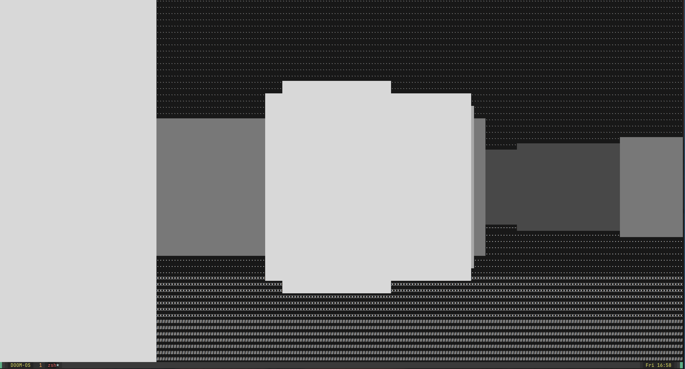

# DOOM-OS 

# Resources 
https://wiki.osdev.org/Main_Page  
https://sortix.org/  
https://toaruos.org/      
http://www.jamesmolloy.co.uk/tutorial_html/  
https://www.youtube.com/watch?v=9t-SPC7Tczc&list=PLFjM7v6KGMpiH2G-kT781ByCNC_0pKpPN  
https://www.youtube.com/watch?v=xW8skO7MFYw  
https://www.youtube.com/watch?v=FaILnmUYS_U&t=763s  

# Work in Process
can run doom clone from `make doom2` and running executable ./bin/doom2

can make iso in current state with `make iso` and executing ./run.sh

